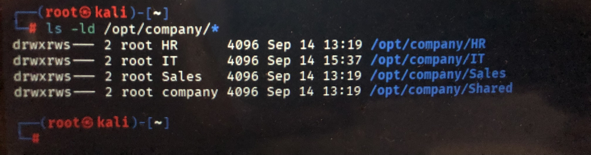

# Phase 1 — Linux Users, Groups & Permissions

## Objective

The objective of this phase was to build and manage a basic company directory structure on Linux using users, groups, ownership, and file permissions.

The practical lab was performed on Kali Linux.

## Company Directory Structure

```text
/opt/company/
├── IT/
├── HR/
├── Sales/
└── Shared/
```

## Users

* `ituser`
* `hruser`
* `salesuser`

## Groups

* `IT`
* `HR`
* `Sales`
* `company`

## Permissions and Ownership

The final directory configuration was:

### HR

```text
Path:        /opt/company/HR
Owner:       root
Group:       HR
Permissions: drwxrws---
```

### IT

```text
Path:        /opt/company/IT
Owner:       root
Group:       IT
Permissions: drwxrws---
```

### Sales

```text
Path:        /opt/company/Sales
Owner:       root
Group:       Sales
Permissions: drwxrws---
```

### Shared

```text
Path:        /opt/company/Shared
Owner:       root
Group:       company
Permissions: drwxrws---
```

The directories were configured with:

```bash
chmod 2770 /opt/company/HR
chmod 2770 /opt/company/IT
chmod 2770 /opt/company/Sales
chmod 2770 /opt/company/Shared
```

This configuration gives the owner and group full access while denying access to other users.

The Setgid bit ensures that newly created files and directories inherit the directory's group.

## Access Tests

Access permissions were tested using different users:

```text
ituser     → IT       : Access successful
ituser     → HR       : Permission denied

hruser     → HR       : Access successful
hruser     → IT       : Permission denied

salesuser  → Sales    : Access successful
salesuser  → IT       : Permission denied

ituser     → Shared   : Access successful
hruser     → Shared   : Access successful
salesuser  → Shared   : Access successful
```

These tests confirmed that users could access their assigned department directory while access to other department directories was restricted.

## Write Permission Test

A write test was performed by `ituser`:

```bash
sudo -u ituser touch /opt/company/IT/test.txt
```

The file was successfully created:

```text
-rw-rw-r-- 1 ituser IT 0 ... test.txt
```

The test file was removed after verification.

## Permission Verification

The final permissions were verified with:

```bash
ls -ld /opt/company/*
```

The observed configuration confirmed:

```text
drwxrws--- 2 root HR      ... /opt/company/HR
drwxrws--- 2 root IT      ... /opt/company/IT
drwxrws--- 2 root Sales   ... /opt/company/Sales
drwxrws--- 2 root company ... /opt/company/Shared
```

Additional verification was performed with:

```bash
getfacl /opt/company/IT
```

Observed result:

```text
owner: root
group: IT
user::rwx
group::rwx
other::---
```

## Troubleshooting

Several command errors occurred during the practical work and were corrected.

### Command Typo

An incorrect command was initially entered:

```bash
sudo usermd -aG IT salesuser
```

The system returned:

```text
sudo: usermd: command not found
```

The correct executable was located with:

```bash
which usermod
```

Result:

```text
/usr/sbin/usermod
```

The command was then corrected and executed:

```bash
sudo /usr/sbin/usermod -aG IT salesuser
```

### Path Typo

An incorrect path was also entered:

```bash
ls -ld /company/*
```

The correct path was:

```bash
ls -ld /opt/company/*
```

The corrected command successfully displayed the company directory permissions.

## Skills Practiced

* Linux users and groups
* `useradd`
* `usermod`
* `groupadd`
* `id`
* `groups`
* `getent group`
* `getfacl`
* `chown`
* `chmod`
* Linux ownership and permissions
* Setgid permissions
* Access testing
* Basic Linux troubleshooting

## Practical Evidence


The practical work was performed on Kali Linux using the commands documented in `commands.md`.

One screenshot is included as visual evidence of the practical work performed during this phase.

## Practical Status

**Applied / Completed**

The company directory structure, users, groups, permissions, access tests, and troubleshooting tasks were practically performed and documented.
