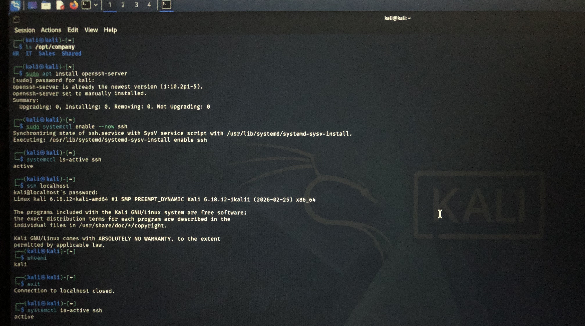

# Phase 3 — SSH Service & Remote Access

> **Status:** ✅ Completed & verified on Kali Linux
> **Service:** OpenSSH
> **Default port:** `22/tcp`

## Objective

Install, enable, manage, test, and perform basic security verification of the SSH service on Kali Linux.

## Lab Overview

| Item             | Details                 |
| ---------------- | ----------------------- |
| Operating system | Kali Linux              |
| Service          | OpenSSH Server (`sshd`) |
| Protocol         | SSH                     |
| Default port     | `22/tcp`                |
| Final state      | Enabled and active      |
| Connection test  | `ssh localhost`         |
| Test user        | `kali`                  |

## Procedure

### 1. Install OpenSSH Server

The OpenSSH server package was installed using:

```bash id="gzdf9a"
sudo apt install openssh-server
```

If the package was already installed, the package manager confirmed that it was up to date.

### 2. Enable and Start the Service

SSH was enabled to start automatically at boot and started immediately:

```bash id="0ex1wx"
sudo systemctl enable --now ssh
```

### 3. Verify the Service State

The current service state was checked with:

```bash id="8v2w5w"
systemctl is-active ssh
```

Observed result:

```text id="qjpk9p"
active
```

### 4. Inspect the SSH Service

The detailed service status was inspected with:

```bash id="q9xj7w"
sudo systemctl status ssh
```

This was also used to verify that SSH was listening on port `22`.

### 5. Test a Local SSH Connection

A local SSH connection was tested using:

```bash id="3d9n8m"
ssh localhost
```

The authenticated user was then verified with:

```bash id="cxj7p5"
whoami
```

Observed result:

```text id="m5a5n1"
kali
```

The SSH session was closed with:

```bash id="v9jbrc"
exit
```

## Service Management Tests

### Stop the SSH Service

The SSH service was stopped with:

```bash id="n3g5za"
sudo systemctl stop ssh
```

The service state was then checked with:

```bash id="ux2am8"
sudo systemctl status ssh
```

Observed state:

```text id="m0i8oy"
inactive (dead)
```

### Start the SSH Service Again

The SSH service was started again with:

```bash id="yx9z5a"
sudo systemctl start ssh
```

The service state was verified again with:

```bash id="h8x4pn"
sudo systemctl status ssh
```

Observed state:

```text id="r4av6n"
active (running)
```

## SSH Configuration Check

The `PermitRootLogin` directive was inspected with:

```bash id="wq6c4t"
sudo grep PermitRootLogin /etc/ssh/sshd_config
```

Observed configuration:

```text id="d3y7sf"
#PermitRootLogin prohibit-password
```

> **Security note:** Direct root login should be avoided unless there is a documented administrative requirement. Individual user accounts with `sudo`, strong authentication, and, where appropriate, SSH keys are preferable.

## Final Verification

The final SSH configuration was verified using:

```bash id="4iq6v2"
sudo systemctl is-enabled ssh
sudo systemctl is-active ssh
```

Final observed results:

```text id="z7qv3s"
SSH service: enabled
SSH service: active
```

## Skills Practiced

* Installing and verifying the OpenSSH server package
* Enabling and starting a system service with `systemctl`
* Stopping and restarting SSH safely
* Checking service status and runtime state
* Testing a local SSH connection
* Verifying the authenticated SSH user
* Inspecting SSH server configuration
* Understanding the role of port `22/tcp`
* Applying basic SSH security considerations

## Practical Evidence


The practical work was performed on Kali Linux using the commands documented in the `commands.md` file.

One screenshot is included as visual evidence of the SSH service and related practical work performed during this phase.

## Completion Checklist

* [x] OpenSSH server installed
* [x] SSH service enabled at startup
* [x] SSH service started successfully
* [x] Local SSH connection tested
* [x] Current SSH user verified
* [x] Stop/start service operations tested
* [x] `PermitRootLogin` configuration inspected
* [x] Final service state confirmed as enabled and active

## Status

**Completed**
