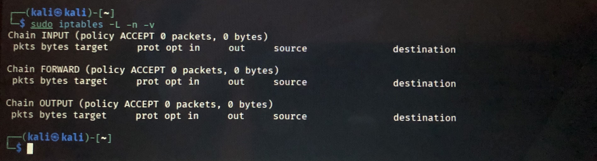

# Phase 4 — Firewall and Security Rules

## Overview

This phase focused on inspecting the firewall configuration of a Kali Linux system and reviewing its current network-filtering policies using `iptables`.

The assessment was limited to inspection and documentation. No firewall rules or policies were added, removed, or modified.

## Objectives

* Inspect the active `iptables` configuration.
* Understand the purpose of the primary firewall chains.
* Identify the default policies for incoming, forwarded, and outgoing traffic.
* Review packet and byte counters.
* Document the observed firewall state without changing the configuration.

## 1. Firewall Inspection

The active `iptables` configuration was inspected with:

```bash
sudo iptables -L -n -v
```

### Command Options

| Option | Description                                                          |
| :----: | -------------------------------------------------------------------- |
|  `-L`  | Lists the rules in each firewall chain.                              |
|  `-n`  | Displays addresses and port numbers in numeric format.               |
|  `-v`  | Displays additional information, including packet and byte counters. |

## 2. Primary Firewall Chains

The inspection displayed the three standard `iptables` chains:

| Chain     | Purpose                                          |
| --------- | ------------------------------------------------ |
| `INPUT`   | Controls traffic entering the Kali Linux system. |
| `FORWARD` | Controls packets routed through the system.      |
| `OUTPUT`  | Controls traffic leaving the system.             |

## 3. Observed Configuration

The inspection showed the following default policies:

| Chain     | Default Policy |
| --------- | -------------- |
| `INPUT`   | `ACCEPT`       |
| `FORWARD` | `ACCEPT`       |
| `OUTPUT`  | `ACCEPT`       |

At the time of testing:

* No additional filtering rules were displayed.
* All three primary chains had an `ACCEPT` default policy.
* Packet counters were `0`.
* Byte counters were `0`.

> **Note:** These observations represent the `iptables` state at the time of inspection. Firewall rules and counters can change depending on system configuration and network activity.

## 4. Security Assessment

At the time of inspection, `iptables` had an `ACCEPT` default policy on the `INPUT`, `FORWARD`, and `OUTPUT` chains, with no additional filtering rules displayed.

Based on this inspection, no active `iptables` rule set restricting network traffic was identified.

This assessment applies specifically to the `iptables` configuration observed during the test and does not by itself establish the complete firewall posture of the system.

No firewall rules or policies were changed during this phase. The work was limited to inspection and documentation.

## 5. Key Takeaways

This phase demonstrated how to:

* Inspect a Linux firewall configuration using `iptables`.
* Distinguish between the `INPUT`, `FORWARD`, and `OUTPUT` chains.
* Interpret default firewall policies.
* Read packet and byte counters.
* Perform a basic firewall configuration assessment.
* Document firewall observations without modifying the system.

## Evidence


The practical work was performed on Kali Linux using the command shown above.

A supporting screenshot is included as visual evidence of the firewall inspection.

## Practical Status

**Applied — Inspection and Documentation Completed**
